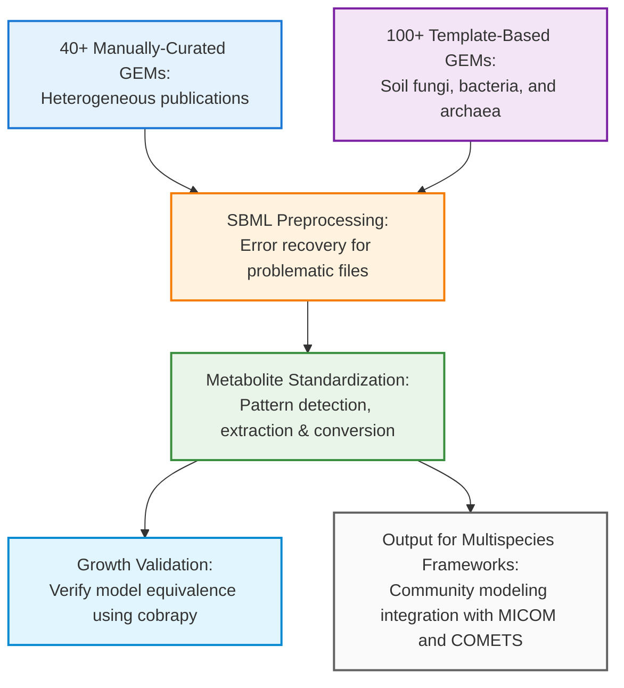

# Genome-scale Metabolic Models (GEMs) for the soil and rhizosphere microbiome

Genome-scale Metabolic Models (GEMs) represent state-of-the-art knowledge for the genomic basis of metabolism for individual microbial species. However, the process of refining the 1000+ reactions within a GEM is time-intensive, and many published GEMs use heterogeneous metabolite annotation formats that prevent integration into multi-species modeling frameworks. For uncultured species that comprise the majority of the soil microbiome, template-based algorithms such as CarveMe and CarveFungi provide the closest approximation to manually-curated GEMs.

This repository provides an automated pipeline that standardizes metabolite annotations across both manually-curated and template-based GEMs, enabling their integration into community modeling frameworks. The pipeline handles diverse annotation formats, ensures simulation equivalence, and outputs models ready for constraint-based analysis of soil microbiome interactions.

### Repository Structure
Each organism has its own directory containing the original SBML files and processed versions. Models are sourced from various publications in different formats (primarily XML/SBML).

### Processing Pipeline
The repository includes an automated R pipeline that standardizes metabolite annotations across all models:

Pattern detection: Automatically identifies annotation formats (RDF, string-based, or multi-database combinations). 

Metabolite standardization: Converts annotations to MetanetX identifiers while preserving simulation outputs

Error recovery: Handles problematic SBML structures including Matrix errors and malformed group elements

Validation: Verifies growth rates match original publications using COBRApy

### Supported Annotation Patterns
The pipeline handles various annotation patterns and structures, including BiGG, ChEBI, KEGG, MetanetX, etc.

### File Structure
Each species directory contains:

*_input.xml - Original SBML file(s)

*_processed.xml - Standardized model with MetanetX annotations

processing_metadata.json - Processing log and conversion statistics

validation_results.json - COBRApy validation results

When available, files associated with original publication

### Community model integration
Processed models are compatible with standard constraint-based modeling frameworks:

    &nbsp; standard Flux-Balance Analysis (FBA), Flux-Variability Analysis (FVA) 
 
    &nbsp; dynamic FBA, spatiotemporal simulations
 
    &nbsp; community trade-offs, growth rate estimation

### Processing Status
60+ models are currently being processed through the standardization pipeline. Models undergo validation to ensure growth rates match published values after annotation standardization.
Dependencies

R packages: sybilSBML, tidyverse, stringr, xml2, jsonlite

Python: cobra (for validation)

Reference data: MetanetX chemical cross-references and deprecated ID mappings (beta release, 2025)
