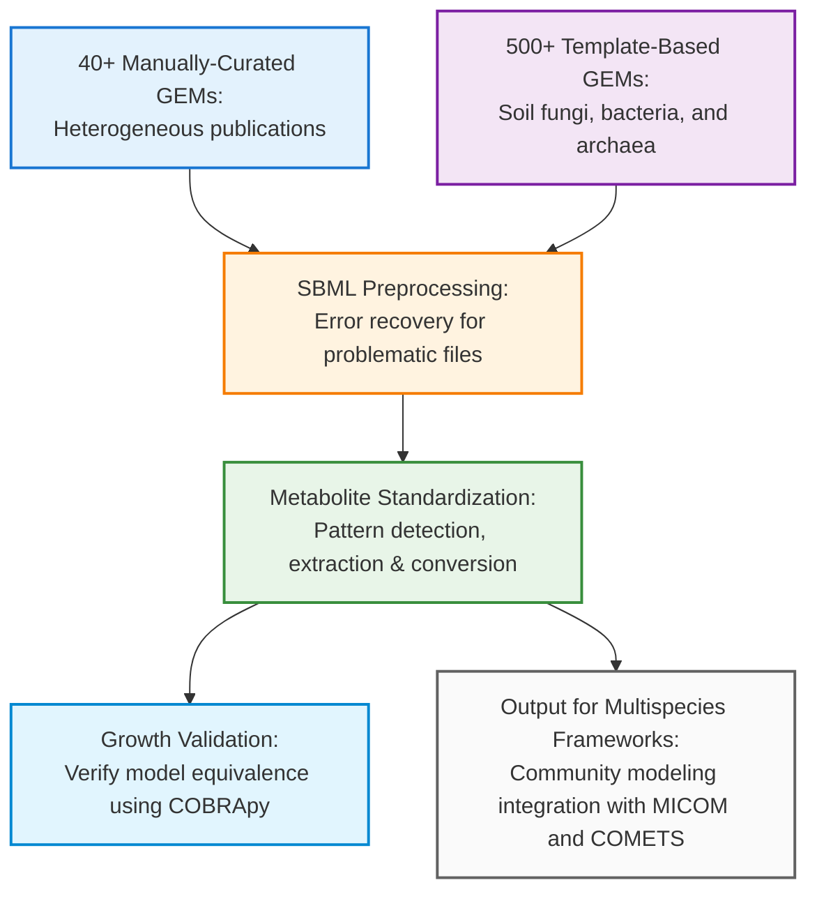

# Genome-scale Metabolic Models (GEMs) for the soil and rhizosphere microbiome


```mermaid
flowchart TD
    A1[40+ Manually-Curated GEMs:<br/>Heterogeneous publications] --> B
    A2[500+ Template-Based GEMs:<br/>Soil fungi, bacteria, and archaea] --> B[SBML Preprocessing:<br/>Error recovery for problematic files]
    B --> C[Metabolite Standardization:<br/>Pattern detection, extraction & conversion]
    C --> D[Growth Validation:<br/>Verify model equivalence using COBRApy]
    C --> E[Output for Multispecies Frameworks:<br/>Community modeling integration with MICOM and COMETS]
    
    style A1 fill:#e3f2fd,stroke:#1976d2,stroke-width:2px
    style A2 fill:#f3e5f5,stroke:#7b1fa2,stroke-width:2px
    style B fill:#fff3e0,stroke:#f57c00,stroke-width:2px
    style C fill:#e8f5e8,stroke:#388e3c,stroke-width:2px
    style D fill:#e1f5fe,stroke:#0288d1,stroke-width:2px
    style E fill:#fafafa,stroke:#616161,stroke-width:2px
```

Genome-scale Metabolic Models (GEMs) represent the genomic basis of metabolism for individual microbial species. Soil microbiomes present unique modeling challenges due to extreme diversity, complex interactions, and the predominance of uncultured species. Most soil microbes cannot be grown in pure culture, making template-based modeling approaches essential for community-level simulations.

Published GEMs use different metabolite annotation formats that prevent integration into multi-species modeling frameworks. This repository provides an automated pipeline that standardizes metabolite annotations across both manually-curated and template-based GEMs, enabling constraint-based modeling of soil microbial communities.

## Processing Pipeline

The R-based pipeline handles diverse annotation formats and SBML structural issues:

**Pattern detection:** Automatically identifies annotation formats (RDF, string-based, or multi-database combinations)

**Metabolite standardization:** Converts annotations to MetanetX identifiers using cross-reference databases

**Error recovery:** Handles SBML validation errors, encoding issues, and malformed XML structures

**Growth validation:** Verifies that processed models maintain equivalent growth rates using COBRApy

## Current Status

36 manually-curated GEMs have been processed through the pipeline with the following results:

- 34/36 successful validations (94%)
- 32/34 input files readable by COBRApy (94%)
- 28/34 processed files readable by COBRApy (82%)
- 25/28 simulation equivalent when both files are readable (89%)

The collection includes nitrogen cycle bacteria (ammonia and nitrite oxidizers), rhizobia, soil decomposers, mycorrhizal fungi, yeasts, and methanogens. These curated models are sourced from publications and the BiGG database. 

Over 500 additional models are derived from template-based algorithms such as CarveFungi and COMMIT.

## File Structure

Each species directory for curated models contains:

- Original SBML file(s)
- `*_processed.xml` - Standardized model with MetanetX annotations
- `processing_metadata.json` - Conversion statistics and logs
- `validation_results.json` - COBRApy validation results
- Supplementary information from publication, when available

## Quickstart

```bash
# 1. System packages (Debian/Ubuntu)
sudo apt-get install -y r-base-core libsbml5-dev libglpk-dev libxml2-dev

# 2. Python dependencies
pip install -r requirements.txt

# 3. R dependencies (handles archived sybilSBML — see notes below)
Rscript scripts/install_r_deps.R

# 4. Reference data (not committed; gitignored due to size)
#    Download MetanetX chemical cross-references into reference_data/
#    See "Reference data" section below.

# 5. Process one species end-to-end
Rscript scripts/run_batch_process.R curated \
    --filter='nitrobacter_winogradskyi_iFC579' \
    --ref-data=reference_data/metanetx_reference_data.rds \
    --deprecated=reference_data/deprecated_recode_mets.rds

# 6. Validate the result with COBRApy
Rscript pipeline/batch_validate_all.R
```

For a flat directory of CarveFungi-style models:

```bash
Rscript scripts/run_batch_process.R flat \
    --input-dir=carvefungi_species/input \
    --output-dir=carvefungi_species/processed \
    --filter='^Aureobasidium' \
    --ref-data=reference_data/metanetx_reference_data.rds \
    --deprecated=reference_data/deprecated_recode_mets.rds
```

## Reference data

`reference_data/chem_xref.tsv`, `chem_prop.tsv`, `reac_xref.tsv`, `reac_prop.tsv` from MetanetX
are gitignored due to size. Download from <https://www.metanetx.org/mnxdoc/mnxref.html>
(beta release, 2025) and run the helpers in `pipeline/sbml_processing_utils.R::get_reference_data()`
to build the `metanetx_reference_data.rds` consumed by the pipeline.

## Dependencies

**R packages:** see `scripts/install_r_deps.R`. The pipeline currently depends on
`sybilSBML`, which was archived from CRAN in 2020 and does not compile cleanly
against modern libSBML. The install script falls back to the GitHub `cran/`
mirror; a Stage-1 replacement using `cobra` via `reticulate` is in progress
(see issue [#2](https://github.com/zoey-rw/soil_microbe_GEMs/issues/2)).

**Python:** see `requirements.txt`. Tested with cobra 0.31.1, python-libsbml 5.21.1,
cometspy 0.6.3.

**Reference data:** MetanetX chemical cross-references and deprecated ID mappings
(beta release, 2025). See above.

## Community Modeling Integration

Processed models are compatible with:

[](https://github.com/opencobra/cobrapy) - Flux Balance Analysis (FBA), Flux Variability Analysis (FVA)

[](https://github.com/segrelab/cometspy) - Dynamic FBA, spatiotemporal simulations

[](https://github.com/micom-dev) - Community trade-offs, growth rate estimation
